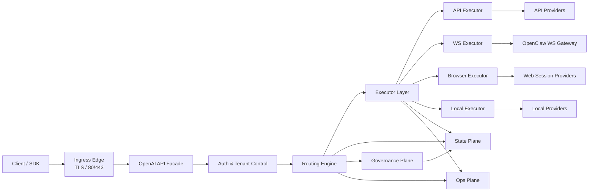
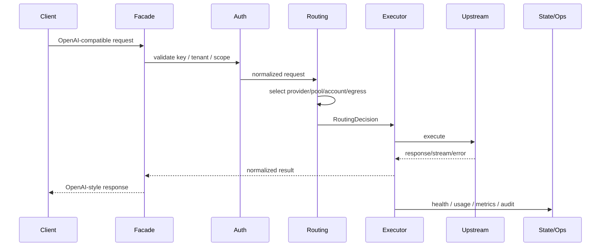
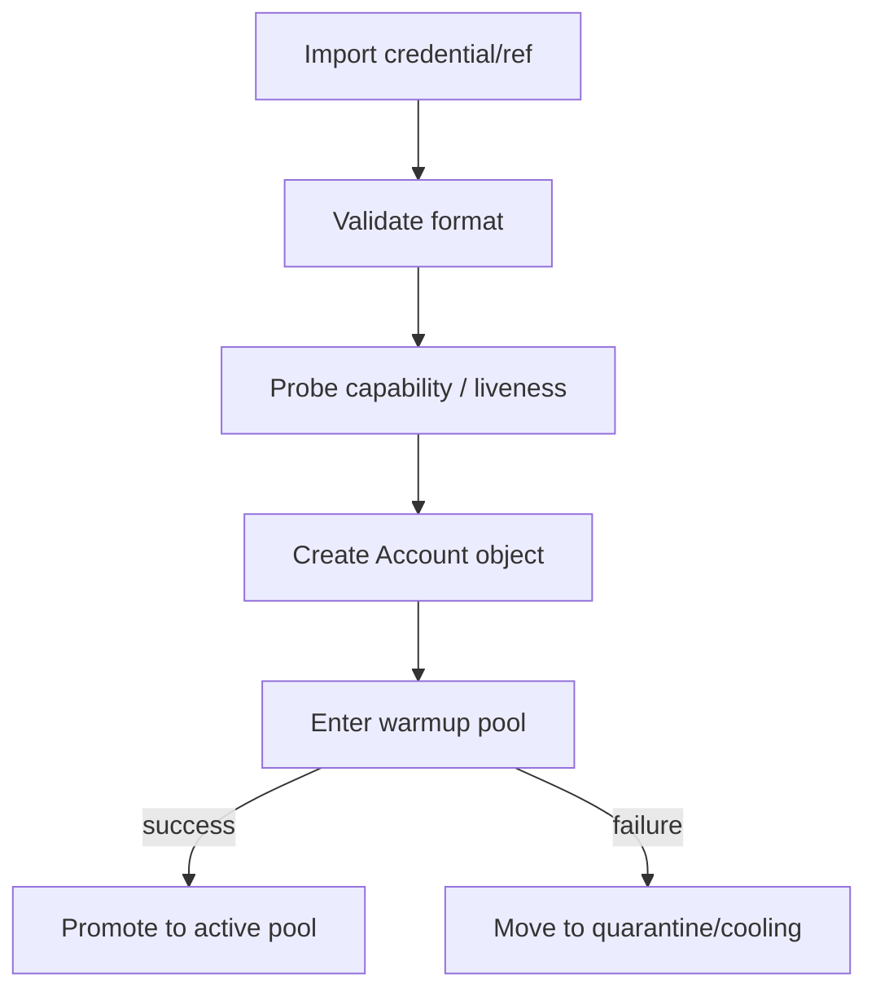
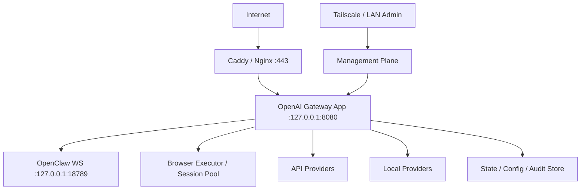

# OpenClaw OpenAI Gateway Control Plane PRD v3

## 1. 摘要

### 1.1 产品一句话定义
OpenClaw OpenAI Gateway Control Plane 是一个**对外兼容 OpenAI 协议、对内统一调度 API / Gateway / Web / Local 多类上游资源，并具备账号池、模型动态分配、IP/出口安全、治理审计与自动化运营能力的 AI 接入控制平台**。

### 1.2 核心价值
本产品的核心价值不在于“做一个简单反代”，而在于构建一个**可持续运营、可控风险、可解释、可扩展**的 AI 接入控制面。它通过统一的兼容接口屏蔽内部复杂性，通过控制平面统一管理账号、模型、Provider、出口、安全边界与运营状态，从而把零散的 AI 接入能力组织成一个可治理的平台。

### 1.3 目标读者
- **产品/架构负责人**：用于统一目标、边界和路线
- **后端/基础设施工程师**：用于理解模块职责与实现主线
- **平台运营人员**：用于理解资源池、治理、容量与成本相关能力
- **安全与运维人员**：用于理解边界设计、审计与回滚机制

### 1.4 当前版本范围
PRD v3 聚焦于定义平台的：
- 产品定位
- 系统边界
- 核心能力
- 主体数据对象
- 模块分层
- 关键流程
- 安全、自动化、治理与运营主线
- 阶段化路线图

本版本**不追求所有实现细节一步到位**，但要求把长期主干、关键边界和演进方向一次定义清楚，避免后续实现过程中结构失控。

### 1.5 本章结论
本产品不是普通代理，也不是单一网关，而是一个**多 Provider AI 接入控制平台**。其长期价值在于统一控制与统一调度，而不是单点转发能力。

---

## 2. 背景与问题定义

### 2.1 背景
随着 AI 模型接入方式逐渐多样化，单一 API 接入模式已经无法覆盖所有真实需求。现实中同时存在以下几类资源入口：
- 标准 HTTP API Provider
- 以 WebSocket 为主入口的 Gateway 型 Provider
- 通过网页端会话访问的 Web Session Provider
- 本地或私有部署的 Local Provider

这些入口在协议、能力、稳定性、安全风险、成本结构和运维方式上差异显著。如果没有统一控制面，系统会自然演化成多个碎片化脚本、独立代理、散乱账号池和临时安全策略的集合，最终导致：
- 资源难以复用
- 风险边界模糊
- 路由不可解释
- 成本不可控
- 故障难以恢复
- 扩展性差

### 2.2 当前问题
当前若仅以“公网反代到 OpenClaw”作为目标，最多只能解决**外部访问入口统一**的问题，但无法解决以下更关键的问题：

#### 问题一：资源入口单一
仅依赖单一上游形态会造成资源脆弱性。某类入口波动、失效或受限时，整体可用性会明显下降，缺少异构冗余。

#### 问题二：账号资源缺乏控制平面
账号往往以零散 token、cookie、session、API key 形式存在，没有统一导入、验证、分组、生命周期、冷却与恢复机制，无法形成可运营的资源池。

#### 问题三：模型分配静态化
如果模型路由仅是简单查表或固定映射，则无法根据成功率、延迟、成本、风险、地区、租户策略做动态分配，也无法形成合理的主备与降级链路。

#### 问题四：公网与上游风险耦合
如果公网入口、业务出口、管理面、Web 会话执行面没有做边界隔离，那么任何一层出现风险都可能污染整条链路，最终带来安全与稳定性问题。

#### 问题五：缺乏治理与可解释性
没有统一审计、路由解释、配置版本化、灰度发布、回滚能力，平台后续演进将高度依赖人工经验，且一旦出问题难以准确复盘。

#### 问题六：缺乏自动化运营能力
没有自动探活、自动冷却、自动恢复、自动预警、自动成本分析，平台越大，人工维护成本越高，最终会反噬可用性。

### 2.3 为什么不能只是简单反代
简单反代只能解决“把某个内网入口暴露给外部客户端”的问题，但这个项目要解决的是更大一层的问题：
- **资源如何被纳管**
- **请求如何被调度**
- **风险如何被隔离**
- **策略如何被治理**
- **系统如何被运营**

因此，本产品必须从一开始就按“控制平面”思路设计，而不是按“反向代理增强版”思路设计。

### 2.4 本章结论
背景决定了本产品必须从“单链路接入”升级为“多资源统一治理”。如果只做简单反代，短期能用，长期一定失控。

---

## 3. 产品定位

### 3.1 产品定位
本产品定位为一个**多上游、多资源池、多安全域、多租户可扩展的 AI 接入控制平台**。
其职责包括：
- 对外提供统一 OpenAI 兼容接口
- 对内屏蔽多种上游协议和资源差异
- 统一管理账号、Provider、Session、模型、出口、策略和配置
- 通过调度引擎把请求安全、可控地分配到合适的执行资源
- 通过治理与运营模块维持平台长期稳定运行

### 3.2 适用场景
#### 场景一：统一对外 AI BaseURL
希望给外部客户端、SDK、自动化系统提供统一 BaseURL，而不直接暴露内部复杂上游结构。

#### 场景二：多账号、多模型、多入口统一管理
当系统中同时存在 API 型账号、Gateway 型上游、网页会话型资源、本地模型或私有模型时，需要统一池化与统一调度。

#### 场景三：高要求的风险隔离与可审计
适用于需要严格区分公网业务面、管理面、上游执行面、凭证面、出口面的环境。

#### 场景四：需要长期演进的平台化场景
当目标不仅是“先跑起来”，而是希望后续支持更多 Provider、更多模型、更多租户、更复杂策略与治理能力时，本平台具备长期演进价值。

### 3.3 非目标
为避免目标失焦，当前明确以下内容不是本阶段主要目标：
- 一开始就覆盖所有 OpenAI 新增接口与全部多模态能力
- 一开始就实现完整图形化控制台
- 一开始就实现跨地域多活高可用架构
- 一开始就引入过于复杂的策略 DSL 或规则引擎
- 一开始就把所有自动化能力做成完全自治系统

### 3.4 产品边界
本产品的边界是：
- **负责接入、调度、治理、运营**
- **不负责替代上游模型本身**
- **不直接改变 OpenClaw 内部能力定义**
- **不默认承诺所有上游永远稳定**
- **不以绕过安全边界为目标**

对 Web Provider 的纳管，应建立在**受控会话、隔离执行、最小暴露、默认低信任**前提下进行，而不是把网页访问能力当成无限可用的透明主干。

### 3.5 核心原则
1. **默认拒绝**
2. **Fail Closed**
3. **内外分离**
4. **策略优先于硬编码**
5. **解释性优先于黑盒调度**
6. **可回滚优先于一次性改死**
7. **自动化优先于长期人工维护**

### 3.6 本章结论
产品定位必须明确为“平台”，不是“代理”。只有用平台思路设计，后续账号池、Provider 池、模型动态分配、安全治理和自动化运营才有统一落点。

---

## 4. 总体目标

### 4.1 对外兼容目标
平台必须对外提供稳定、标准化的 OpenAI 兼容接口，使调用方尽可能使用熟悉的 SDK 和调用方式接入，而无需感知内部上游的复杂差异。

### 4.2 对内隔离目标
平台必须把外部调用入口与内部上游能力彻底解耦。

### 4.3 动态调度目标
平台不应采用静态写死的模型映射方式，而应具备可演进的动态调度能力。

### 4.4 安全治理目标
平台必须具备完整的边界控制能力，而不是后补型安全。

### 4.5 自动化运营目标
平台最终不应依赖大量人工日常维护。

### 4.6 演进性目标
平台设计必须允许未来继续扩展，而不推倒重来。

### 4.7 成功标准
1. 外部客户端可以直接把它当 OpenAI BaseURL 使用
2. OpenClaw 内部协议不暴露公网
3. 多类 Provider 能被统一纳管
4. 模型能按策略动态分配
5. 账号、会话、出口都能被池化和治理
6. 风险边界清晰，日志与配置可审计
7. 平台出现问题时能解释、能恢复、能回滚

### 4.8 本章结论
总体目标不是“能转发”，而是“能兼容、能隔离、能调度、能治理、能运营、能演进”。

---

## 5. 核心能力总表

### 5.1 OpenAI 兼容接入能力
- `GET /v1/models`
- `POST /v1/chat/completions`
- `POST /v1/responses`
- `POST /v1/embeddings`（后续）
- 支持非流式与 SSE 流式
- 统一错误结构与状态码行为

### 5.2 多 Provider 纳管能力
平台必须统一纳管四类上游资源：
1. **API Provider**
2. **Gateway Provider**
3. **Web Session Provider**
4. **Local Provider**

### 5.3 账号导入与账号池能力
- 单账号导入
- 批量导入
- 导入校验
- 导入后探活
- 标签、分组、用途归类
- 生命周期状态
- 冷却、恢复、隔离与禁用

### 5.4 Browser Session Pool 能力
- 浏览器 Profile 管理
- Session 池管理
- Session Warmup
- 登录态检测
- Challenge / 异常页检测
- Session 健康打分
- Session 冷却、重建与隔离

### 5.5 模型目录与能力注册能力
- 模型 canonical name 与 alias
- 能力标签
- 成本画像
- 延迟画像
- 对应可用 Provider
- 对应可用池和可用地区
- 生命周期状态

### 5.6 动态路由与调度能力
- Provider Class 选择
- Provider 选择
- 账号池 / Session 池选择
- 出口选择
- 主备候选生成
- Fallback 链路生成
- 熔断、降级、冷却与恢复
- 路由解释输出

### 5.7 出口与 IP 安全能力
- 公网入口与业务出口分层
- 管理面与业务面隔离
- Egress Profile 池化
- 地区绑定与风险绑定
- 高风险出口摘除
- 出口健康检查与评分

### 5.8 鉴权、租户与权限能力
- API Key
- Tenant / Project
- Scope / Role / RBAC
- 模型白名单
- Provider 使用范围
- 配额和限流策略

### 5.9 审计、治理与配置能力
- 配置版本化
- 路由策略版本化
- 审计事件记录
- 变更计划与审批
- 灰度 / Canary
- Rollback
- 路由与变更解释能力

### 5.10 自动化与运营能力
- 自动探活
- 自动健康治理
- 自动风险检测
- 自动冷却/恢复
- 成本、容量、稳定性观测
- 告警、日报、复盘草稿
- Replay 与诊断工具

### 5.11 本章结论
核心能力不应只看接口，还必须同时覆盖：**兼容、纳管、调度、安全、治理、自动化运营**。

---

## 6. 核心数据模型

### 6.1 设计目标
核心数据模型的职责，是把平台中的关键资源、关键状态、关键决策和关键治理对象统一抽象出来。

### 6.2 对象分组
平台的核心对象分为 8 个对象群：
1. 身份与权限对象
2. 账号与会话资源对象
3. Provider 与模型对象
4. 出口与网络边界对象
5. 调度与执行对象
6. 健康与运行状态对象
7. 治理与审计对象
8. 运营与成本对象

### 6.3 身份与权限对象
#### Tenant
最高业务隔离单元，承载组织、团队或独立业务群。

#### Project
Tenant 下的次级隔离单元，用于表达具体业务环境或应用。

#### ApiKey
外部调用方进入平台的主要身份凭证。

#### RoleBinding
表达谁可以操作哪些对象，以及以什么权限操作。

### 6.4 账号与会话资源对象
#### Account
可被平台使用的上游账号资源，不只是 token 或 cookie，而是具备状态、能力、风险和健康属性的治理对象。

#### AccountPool
账号资源的逻辑池化单元。

#### PoolMembership
池和成员之间的关系对象。

#### WebSession
网页型 Provider 的执行会话对象。

#### BrowserProfile
网页执行上下文。

### 6.5 Provider 与模型对象
#### Provider
统一上游抽象，至少包含 `api / gateway / web / local`。

#### ProviderCapability
描述某个 Provider 对某个模型或某类能力的支持情况。

#### ModelCatalogEntry
平台内部的统一模型目录对象。

#### ModelAvailability
表示模型在某个 Provider/Pool/Region 上当前是否可用。

### 6.6 出口与网络边界对象
#### EgressProfile
受控出口资源。

#### EgressPolicy
表达“什么样的请求可以使用什么样的出口”。

#### NetworkBoundary
定义不同暴露面的安全边界。

### 6.7 调度与执行对象
#### RoutePolicy
调度规则的核心对象。

#### RoutingDecision
表示一次请求最终被如何选择和解释。

#### ExecutionAttempt
表示一次路由决策下的具体执行尝试。

#### StreamSession
表示一次流式会话。

### 6.8 健康与运行状态对象
#### HealthState
所有可调度对象的统一健康视图。

#### CircuitState
熔断器状态。

#### CapacityState
某个 Provider、Pool 或出口当前负载和饱和度。

### 6.9 治理与审计对象
#### ConfigSnapshot
某个时刻的配置快照版本。

#### AuditEvent
操作或系统事件的审计记录。

#### ChangePlan
表达一次有意图的配置变更。

### 6.10 运营与成本对象
#### UsageRecord
记录一次调用的资源消耗情况。

#### CostRecord
表示资源消耗对应的成本。

#### AlertEvent
表示某个值得运营关注的事件。

### 6.11 对象之间的核心关系
- Tenant 拥有多个 Project
- Project 绑定多个 ApiKey
- ApiKey 发起请求，触发 RoutingDecision
- RoutingDecision 依赖 RoutePolicy
- RoutePolicy 选择 Provider / Pool / Account / WebSession / EgressProfile
- Account / WebSession / Provider / EgressProfile 都拥有 HealthState
- 具体调用形成一个或多个 ExecutionAttempt
- 流式调用额外形成 StreamSession
- 所有配置变化写入 ConfigSnapshot / ChangePlan
- 所有重要动作写入 AuditEvent
- 所有资源消耗写入 UsageRecord / CostRecord
- 异常状态形成 AlertEvent

### 6.12 数据模型设计原则总结
1. **资源对象化**
2. **状态外显化**
3. **决策可追踪**
4. **治理可版本化**
5. **安全可隔离**
6. **运营可量化**

### 6.13 本章结论
核心数据模型的本质，是把平台从“代码流程”提升成“控制平面”。

---

## 7. 模块架构

### 7.1 设计目标
模块架构设计的目标，是先回答 3 个问题：
1. 哪些能力必须独立成层
2. 每一层只应该负责什么
3. 层与层之间如何交互，哪些事情绝不能跨层做

### 7.2 总体分层
平台建议分为 8 个核心模块层：
1. Ingress Edge
2. OpenAI API Facade
3. Auth & Tenant Control
4. Routing Engine
5. Executor Layer
6. State Plane
7. Governance Plane
8. Ops Plane

### 7.3 Ingress Edge
负责域名与 TLS、公网 `80/443` 暴露、基础反向代理和基础连接级限制。**Ingress Edge 是门，不是脑。**

### 7.4 OpenAI API Facade
负责外部 OpenAI 风格接口、请求/响应规范化和错误归一化。**Facade 是脸，不是脑，也不是手。**

### 7.5 Auth & Tenant Control
负责 API Key 校验、Tenant / Project 识别、权限、配额与限流前置判断。**这层负责决定“能不能进”，不负责决定“进去后怎么跑”。**

### 7.6 Routing Engine
负责模型策略匹配、Provider Class/Provider/Pool/Account/Session/Egress 选择、fallback chain 生成和 RoutingDecision 生成。**Routing Engine 是脑子。**

### 7.7 Executor Layer
负责真正执行路由层做出的决策，可细分为 API / WS / Browser / Local 四类执行器。**Executor 是手，不是脑。**

### 7.8 State Plane
承载当前可调度世界的事实视图，包括健康、熔断、容量、可用性、运行态缓存等。**State Plane 是记忆，不是意志。**

### 7.9 Governance Plane
负责 ConfigSnapshot、ChangePlan、审计、配置版本管理、发布、灰度与回滚。**Governance Plane 管“怎么改系统”，不管“每次请求怎么跑”。**

### 7.10 Ops Plane
负责 metrics、usage/cost、alert、replay、容量与趋势分析。**Ops Plane 是仪表盘和运营台，不是发动机。**

### 7.11 跨模块调用原则
主请求链路推荐按这个顺序走：
**Ingress Edge → OpenAI API Facade → Auth & Tenant Control → Routing Engine → Executor Layer → 回写 State Plane → 异步写入 Governance Plane / Ops Plane**

### 7.12 部署视角下的模块建议
- 可同进程起步：Facade、Auth、Routing、基础 State 读缓存
- 建议独立演进：Browser Executor、Governance、Ops
- 必须保持边界隔离：公网 Ingress、管理面入口、Web Provider 执行环境、凭证/Profile 存储

### 7.13 为什么必须这样分层
因为这个项目未来会天然遇到协议复杂度、资源复杂度、安全复杂度、运营复杂度四类叠加。

### 7.14 本章结论
模块架构本质上把系统拆成：**门、脸、门禁、脑、手、记忆、治理台、运营台**。

---

## 8. 关键流程

### 8.1 设计目标
关键流程章节要回答：请求怎么跑、资源怎么参与、失败怎么回退、治理与回写发生在什么位置。

### 8.2 请求主流程
1. 请求进入 Ingress Edge
2. 进入 OpenAI API Facade
3. 进入 Auth & Tenant Control
4. 进入 Routing Engine
5. 进入 Executor Layer
6. 响应回到 Facade
7. 回写状态

### 8.3 `/v1/models` 流程
- 鉴权并识别 Tenant / Project
- 读取模型目录
- 根据权限与可用性过滤模型
- 生成标准 list JSON
- 刷新失败时优先使用缓存

### 8.4 Chat / Responses 调用流程
Facade 先做输入标准化，再交由 Routing Engine 决策，Executor 执行，Facade 统一输出。若 `stream=true`，由 StreamSession 跟踪状态。

### 8.5 账号导入流程
1. 导入凭证或凭证引用
2. 基础格式校验
3. 绑定 Provider
4. 探活与能力校验
5. 生成 Account
6. 打标签与配置属性
7. 进入 warmup pool
8. 成功迁入 active，失败进入 quarantine / cooling

### 8.6 WebSession 生命周期流程
1. 创建 BrowserProfile
2. 绑定 EgressProfile
3. 注入或关联登录态
4. 检查登录状态
5. 执行 warmup
6. 生成 WebSession
7. 纳入 session pool
8. 异常时冷却、隔离或重建

### 8.7 路由与 fallback 流程
1. 选模型策略
2. 选 Provider Class
3. 选 Provider
4. 选 Pool
5. 选 Account / Session
6. 选 Egress
7. 生成 fallback chain

### 8.8 健康治理流程
执行后产生结果，更新 HealthState，并根据阈值做降级、冷却、熔断、权重更新与 Alert。

### 8.9 配置变更 / 灰度 / 回滚流程
创建 ChangePlan → 校验风险 → 审批 → 生成 ConfigSnapshot → 灰度 / canary → 正式切换或回滚 → 全程审计。

### 8.10 本章结论
关键流程定义的是平台“怎么活”。

---

## 9. 安全设计

### 9.1 设计目标
安全设计必须覆盖：公网面、管理面、执行面、凭证面、出口/IP 面、Web Provider 风控面。

### 9.2 总体安全原则
1. 默认拒绝
2. Fail Closed
3. 最小暴露
4. 最小权限
5. 边界隔离
6. 敏感信息默认脱敏
7. 高风险资源默认低信任
8. 配置变更可审计、可回滚

### 9.3 公网面安全
- 只开放 `80/443`
- 所有业务请求必须鉴权
- 不暴露 OpenClaw WS、管理面、内部错误细节

### 9.4 管理面安全
- 仅限内网 / Tailscale / 白名单来源
- 管理操作必须审计
- 高危操作必须二次确认或审批

### 9.5 凭证安全
- 凭证只以 secret ref 或受控存储引用形式参与主流程
- 普通日志中禁止明文输出
- 导出内容默认脱敏
- 过期与轮换要可追踪

### 9.6 执行面安全
- API / WS / Browser / Local executor 逻辑隔离
- Browser executor 建议独立隔离环境
- 执行器层不拥有治理特权

### 9.7 出口与 IP 安全面
显式区分公网入口 IP、上游业务出口 IP、管理面网络和 Web Provider 执行出口。

### 9.8 Web Provider 风控
- BrowserProfile 隔离
- WebSession 独立建模
- login_state / challenge_state 跟踪
- DOM 异常分类
- 自动降权 / 冷却 / 隔离
- 默认不作为唯一主链

### 9.9 审计与安全可追踪
所有安全相关动作都必须可回溯。

### 9.10 本章结论
安全设计的关键，是把外部入口、内部执行、管理变更、凭证、出口、Web 会话这几类风险面彻底切开。

---

## 10. 自动化设计

### 10.1 设计目标
自动化设计的目标，是把平台从“依赖人工盯着跑”升级成“能自我维持基本秩序”。

### 10.2 自动化分层
1. 自动探活层
2. 自动健康治理层
3. 自动策略建议层
4. 自动运营层

### 10.3 自动探活层
对 Account、Provider、WebSession、EgressProfile、ModelAvailability 做定期可用性检查、登录状态检查、模型能力检查和出口连通性检查。

### 10.4 自动健康治理层
- 自动冷却
- 自动恢复
- 自动熔断
- 自动降权
- 自动迁池
- 自动隔离异常资源

### 10.5 自动策略建议层
- 某模型更适合某个 Provider Class
- 某出口成本高但收益低，应降权
- 某账号池适合拆分
- 某 fallback 顺序效果差，应调整
- 某租户存在高失败高频组合风险

### 10.6 自动运营层
- 风险日报
- 健康日报
- 成本日报
- 容量预警
- provider 稳定性排行
- 故障复盘草稿
- 异常聚类摘要

### 10.7 自动化边界
能做的是检查、打分、冷却、恢复、建议、报警；不能承诺所有上游异常都能自动修好。

### 10.8 自动化与治理的关系
自动化动作不应绕过治理体系，高风险自动动作要有阈值，关键变化应写审计或事件流。

### 10.9 本章结论
自动化设计的核心不是“更聪明”，而是“更稳定、更省人、更可预期”。

---

## 11. 治理设计

### 11.1 设计目标
治理设计解决的不是“系统怎么跑”，而是“系统怎么安全地改变”。

### 11.2 治理对象
- `ConfigSnapshot`
- `ChangePlan`
- `AuditEvent`
- `RoleBinding`
- 各类策略对象

### 11.3 配置版本化
应版本化：Provider 启用状态、模型目录、路由策略、池权重、Egress 策略、限流配额、权限范围、Web Provider 风控策略。

### 11.4 变更计划（ChangePlan）
高影响变更应先形成计划，再执行。

### 11.5 灰度发布与 Canary
支持按 Tenant / Project / 模型 / Provider Class 灰度，灰度失败必须能快速回滚。

### 11.6 回滚设计
回滚点必须在变更前存在，回滚过程必须审计，回滚后需自动产生观察窗口和复盘记录。

### 11.7 权限治理
建议角色：admin / operator / auditor / viewer。

### 11.8 审计治理
必须审计：凭证导入更新删除、Provider 启停、策略修改、池成员变更、出口策略变更、回滚、审批、敏感导出、高风险 Web Provider 操作。

### 11.9 本章结论
治理设计的本质，是让平台具备**可控变更能力**。

---

## 12. 运营设计

### 12.1 设计目标
运营设计解决平台长期运行中如何维持稳定、控制成本、预防资源耗尽，并让人能看得懂现状。

### 12.2 稳定性运营
核心指标：request success rate、first token latency、full response latency、provider/pool/egress success rate、stream interruption rate、fallback hit rate。

### 12.3 容量运营
关注 AccountPool 容量、WebSession 池容量、Provider 并发饱和度、Egress 负载、租户级用量峰值、热门模型调用压力。

### 12.4 成本运营
统计每 Tenant / Project / 模型 / Provider / 出口成本，并支持成本趋势图、异常预警和低成本替代建议。

### 12.5 风险运营
关注高失败租户、高 challenge WebSession、稳定性突然下降出口、fallback 命中率异常升高、区域性模型退化等。

### 12.6 资源运营
识别闲置账号、高频失败会话、权重失衡池成员、低价值 EgressProfile 与不再值得保留的 Provider。

### 12.7 告警与日报
建议输出每日健康摘要、风险日报、成本日报、容量告警、故障复盘草稿、重大变更影响摘要。

### 12.8 本章结论
运营设计让平台从“可以运行”升级到“可以长期维护”。

---

## 13. 路线图

### 13.1 设计目标
把长期蓝图拆成可推进主线，避免项目被“功能很多但永远落不了地”拖死。

### 13.2 V1：兼容入口 MVP
**MUST**：`healthz` / `readyz`、API Key 鉴权、`/v1/models`、`/v1/chat/completions`、`/v1/responses`、基础 WS bridge、基础错误归一化、request id / 基础日志。

### 13.3 V2：资源池化与动态调度
**MUST**：Account / AccountPool、Provider 抽象、RoutePolicy、RoutingDecision、EgressProfile、账号导入与探活、健康分 / 冷却 / 基础熔断。

### 13.4 V3：异构 Provider 与治理
**MUST**：WebSession / BrowserProfile、Browser Executor、challenge / login_state 管理、ConfigSnapshot / ChangePlan / AuditEvent、入口/出口/管理面隔离、路由解释能力。

### 13.5 V4：自动化运营平台
**MUST**：自动探活、自动冷却 / 恢复 / 隔离、告警系统、成本 / 容量分析、回放 / 诊断工具、rollback workflow。

### 13.6 本章结论
路线图的正确顺序是：**先兼容，再调度；先池化，再治理；先稳定，再自动化。**

---

## 14. 风险清单与控制措施

### 14.1 技术风险
- 上游协议变化 → adapter 层隔离、capability 探测、mock / 回归测试
- 流式链路不稳定 → StreamSession、首包/断流监控、fallback 仅作用于新请求
- 路由复杂度失控 → RoutePolicy 集中化、explainability、初期限制规则种类

### 14.2 安全风险
- 凭证泄漏 → secret ref、默认脱敏、最小权限、凭证轮换
- 管理面暴露 → 管理面内网/Tailscale only、审计与审批
- Web Provider 高风险 → BrowserProfile 隔离、WebSession 状态化、challenge 检测、默认低权重
- IP 风险污染 → 入口/出口分离、EgressProfile 池化、高风险资源独立出口

### 14.3 运营风险
- 资源池耗尽 → 容量看板、阈值预警、warmup 建议、fallback 池
- 成本失控 → CostRecord、tenant/project 预算、成本异常预警
- 问题不可解释 → RoutingDecision、ExecutionAttempt、request id / trace id、AuditEvent

### 14.4 产品风险
- 目标过大，迟迟不落地 → V1–V4 路线图、MUST/SHOULD/COULD
- 功能膨胀，主线丢失 → 统一数据模型、统一模块边界、统一 RoutePolicy 收口

### 14.5 本章结论
风险不可消灭，但必须被**分类、对象化、策略化、可追踪化**。

---

## 15. 验收标准

### 15.1 产品级验收标准
1. **对外兼容**：OpenAI SDK 可通过 `base_url + api_key` 接入
2. **对内隔离**：OpenClaw WS 不暴露公网
3. **资源可纳管**：账号可导入、探活、分组、池化；WebSession 可创建、预热、隔离、回收；出口可建模、可评分、可选择
4. **路由可调度**：模型可按策略动态分配，支持 Provider / Pool / Egress 选择，支持 fallback / 冷却 / 熔断
5. **安全可控**：公网面、管理面、执行面、出口面边界清晰，凭证最小暴露，高风险资源可隔离
6. **治理可追踪**：配置有版本、变更有计划、审计可查询、回滚可执行
7. **运营可持续**：成功率、延迟、成本、容量可观测，告警、风险、健康状态可输出，自动化治理基础能力可用

### 15.2 阶段级验收标准
#### V1 验收
- OpenAI 兼容入口可用
- OpenClaw 内部入口未暴露
- 基础鉴权与错误归一化成立

#### V2 验收
- 账号池与 RoutePolicy 生效
- 动态路由与 fallback 生效
- 健康分与冷却生效

#### V3 验收
- WebSession 可纳管
- BrowserProfile 隔离成立
- ConfigSnapshot / ChangePlan / AuditEvent 生效
- 入口/出口/管理面边界成立

#### V4 验收
- 自动探活与自动治理成立
- 成本/容量/风险运营成立
- rollback workflow 与诊断工具可用

### 15.3 本章结论
验收标准的意义，不是列愿望，而是给每个阶段一个明确收口点。

---

## 16. 附录

### 16.1 名词表
- **Provider Class**：上游类型，如 `api/gateway/web/local`
- **Facade**：对外兼容层，统一输出 OpenAI 风格接口
- **RoutePolicy**：路由策略对象
- **RoutingDecision**：单次请求的最终资源选择结果
- **ExecutionAttempt**：一次具体执行尝试
- **WebSession**：网页型上游的会话资源对象
- **BrowserProfile**：网页型上游的浏览器上下文对象
- **EgressProfile**：出口/IP 资源对象
- **ConfigSnapshot**：配置快照版本对象
- **ChangePlan**：治理变更计划对象

### 16.2 缩写表
- **PRD**：Product Requirements Document
- **RBAC**：Role-Based Access Control
- **SSE**：Server-Sent Events
- **WS**：WebSocket
- **MVP**：Minimum Viable Product
- **SLO/SLA**：服务目标/服务级别协议

### 16.3 待确认问题清单
1. V1 是否只面向 OpenClaw WS，还是同时预留 API Executor
2. Web Provider 的第一优先目标是 ChatGPT、Claude 还是 Gemini
3. 状态层首版采用内存 + SQLite，还是直接采用更独立的存储方案
4. V1 是否需要一开始就纳入 Tenant / Project 抽象，还是先单租户内核后扩展
5. EgressProfile 首版是否仅做抽象预留，暂不做复杂调度

### 16.4 后续扩展点
- 多地域部署
- 插件化 Provider 注册
- 可视化控制台
- 成本预算与结算体系
- 策略 DSL
- Shadow Traffic / Replay / Chaos Testing

---

## 17. 架构图与流程图

### 17.1 顶层架构图

### 17.2 请求主流程图

### 17.3 账号导入流程图

### 17.4 部署拓扑图

