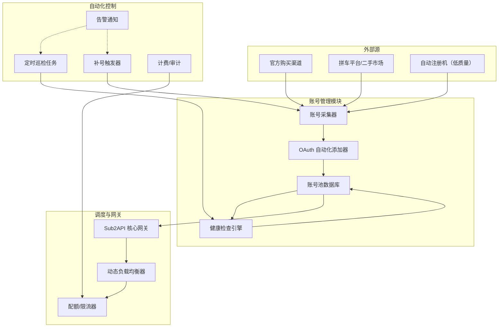

为了构建一个真正“无人值守”的 ChatGPT 账号池反代服务（Sub2API），我们需要将账号获取、OAuth 授权、健康监控、动态调度、自动补号、账单审计等环节全部自动化。下面从架构设计、关键模块、实现细节到部署建议，提供一套完整的技术方案。

---

## 🧩 整体架构设计



---

## 🔧 关键模块实现细节

### 1. 账号自动化获取

**目标**：自动从多种渠道获取 Team 子号凭证，并录入系统。

#### 1.1 官方直购（推荐）

- 使用 **虚拟信用卡 + 自动化脚本** 批量注册 Team 账户（风险较高，不推荐批量）。
- 更稳妥的方式：从二手平台（如某鱼）购买 Team 子号，通过爬虫监听特定关键词，自动下单并提取账号密码。

**技术实现**：
- 使用 **Playwright** 模拟浏览器自动登录某鱼，监控新发布的商品。
- 通过 OCR 或自动填写下单流程，获取账号信息。
- 将账号密码存入队列，等待 OAuth 添加。

#### 1.2 拼车平台 API

部分拼车平台提供 API 接口（如付费的账号池服务），可直接调用获取可用的 Team 子号。可编写脚本定期调用并同步到本地。

#### 1.3 自动注册（备选）

- 使用 **一次性邮箱** 服务（如 10minutemail）注册免费账号。
- 但免费账号配额低，仅适用于测试或备用。
- 需配合人机验证解决服务（如 2captcha）。

### 2. OAuth 自动化添加

Sub2API 官方要求手动 OAuth 授权，但可以通过自动化脚本模拟。

**方案**：使用 **Playwright** 驱动浏览器完成以下步骤：

```python
import asyncio
from playwright.async_api import async_playwright

async def add_team_account(email, password):
    async with async_playwright() as p:
        browser = await p.chromium.launch(headless=False)  # 建议有头模式调试
        context = await browser.new_context()
        page = await context.new_page()

        # 1. 访问 Sub2API 后台的 OAuth 添加页面
        await page.goto("http://your-sub2api/admin/account/add")
        # 登录后台（需要先获取 session cookie，此处省略）

        # 2. 点击“生成 OAuth 链接”
        await page.click("button:has-text('生成OAuth链接')")
        oauth_url = await page.get_attribute("a:has-text('点击这里授权')", "href")

        # 3. 打开新标签页进行授权
        oauth_page = await context.new_page()
        await oauth_page.goto(oauth_url)

        # 4. 输入邮箱密码
        await oauth_page.fill("input[type='email']", email)
        await oauth_page.click("button:has-text('Continue')")
        await oauth_page.fill("input[type='password']", password)
        await oauth_page.click("button:has-text('Continue')")

        # 5. 选择 Team 工作空间（关键！）
        await oauth_page.click("button:has-text('Select')")  # 根据实际 selector
        # 如果有多个工作空间，选择 Team 那个

        # 6. 授权成功后，跳转到 localhost，获取完整 URL
        await oauth_page.wait_for_url("http://localhost/*")
        callback_url = oauth_page.url

        # 7. 回到原页面，粘贴回调 URL 并确认
        await page.fill("input[name='callback_url']", callback_url)
        await page.click("button:has-text('确认添加')")

        await browser.close()
```

- 可封装成批量添加脚本，循环读取账号队列。
- 注意处理验证码（2captcha 集成）和可能的异常重试。

### 3. 账号健康监控

Sub2API 本身提供账号配额显示，但需要更细粒度的健康检查：

- **配额检测**：定期调用 Sub2API 的 `/admin/api/accounts` 接口获取每个账号的剩余消息数。
- **可用性检测**：通过发出一条极低成本的消息（如 `"hello"` 并设置 `max_tokens=1`）来测试账号是否正常响应。
- **限流检测**：若返回 `429` 或 `rate_limit` 错误，标记账号为“冷却中”，一定时间后重试。

**定时任务**：
```bash
# 使用 cron 每 15 分钟执行健康检查脚本
*/15 * * * * /usr/bin/python3 /opt/health_check.py
```

健康检查结果写入数据库，并触发后续动作（如禁用异常账号、通知管理员）。

### 4. 动态负载均衡

Sub2API 原生支持按账号权重轮询，但我们可以进一步增强：

- **响应时间加权**：记录每个账号最近 5 次请求的平均延迟，延迟低的账号获得更高权重。
- **剩余配额优先**：配额充足的账号优先被调度。
- **会话粘滞**：同一会话（如对话上下文）固定使用同一账号，避免上下文丢失。

**实现方式**：修改 Sub2API 的调度器逻辑（基于 Python 可二次开发），或者通过外部代理（如 Nginx + Lua）实现更复杂的路由。

### 5. 自动补号与配额管理

当账号池中剩余可用账号数量低于阈值（如少于 3 个）时，触发补号流程：

- **补号源**：从账号获取队列中拉取新账号。
- **自动化添加**：调用 OAuth 自动化脚本添加新账号。
- **验证健康**：添加后立即进行健康测试，通过后加入池子。

**配额续期**：对于 Team 子号，如果是按月付费，需要定期自动续费（如果账号是购买的二手子号，可能需要人工续费）。可通过设置到期提醒，集成支付接口自动续费（如对接某宝/某鱼自动下单），但较为复杂。更简单的做法：提前批量采购多个账号，设置到期预警，手动补充。

### 6. 监控告警与审计

- **告警渠道**：集成 **Telegram Bot**、**钉钉**、**Server酱**，在账号封禁、配额耗尽、自动补号失败时及时通知。
- **审计日志**：Sub2API 自带调用日志，可导出到 **Elasticsearch + Kibana** 进行可视化分析，统计每个账号的调用量、成本、错误率。

**日志示例**：
```json
{
  "timestamp": "2025-03-30T10:00:00Z",
  "api_key": "sk-xxxx",
  "account_id": "team_001",
  "model": "gpt-5.4",
  "tokens": 1234,
  "cost": 0.001,
  "status": "success"
}
```

### 7. 高可用部署

- **多节点 Sub2API**：使用 Docker Swarm 或 Kubernetes 部署多个实例，共享 PostgreSQL 和 Redis。
- **负载均衡**：前端加 Nginx 做反向代理，支持 HTTPS、限流、IP 白名单。
- **数据备份**：每天定时备份数据库到对象存储（如 AWS S3、阿里云 OSS）。

---

## 🤖 全流程自动化脚本示例

以下是一个简化的自动化主控脚本（Python），负责定时巡检并补号：

```python
import asyncio
import logging
from datetime import datetime

from account_fetcher import fetch_new_accounts
from oauth_adder import add_account_to_sub2api
from health_checker import check_account_health

logging.basicConfig(level=logging.INFO)
logger = logging.getLogger(__name__)

async def main():
    # 1. 获取当前账号池状态（通过 Sub2API API 获取）
    accounts = await get_accounts_from_sub2api()
    healthy_count = sum(1 for a in accounts if a['status'] == 'healthy')
    logger.info(f"当前健康账号数: {healthy_count}")

    # 2. 如果健康账号少于阈值，则补号
    if healthy_count < MIN_HEALTHY_ACCOUNTS:
        logger.warning("健康账号不足，开始补号")
        new_accounts = fetch_new_accounts(count=5)  # 获取 5 个新账号
        for acc in new_accounts:
            success = await add_account_to_sub2api(acc['email'], acc['password'])
            if success:
                logger.info(f"账号 {acc['email']} 添加成功")
                # 添加后立刻健康检查
                await check_account_health(acc['id'])
            else:
                logger.error(f"账号 {acc['email']} 添加失败")

    # 3. 对所有账号进行健康检查
    for acc in accounts:
        await check_account_health(acc['id'])

    # 4. 发送统计报告
    await send_report()

if __name__ == "__main__":
    asyncio.run(main())
```

将此脚本加入 cron，每 30 分钟执行一次。

---

## ⚠️ 风险与注意事项

1. **账号封禁风险**：OpenAI 对非官方客户端调用检测越来越严，建议使用 Team 账号并控制调用频率（每个账号 QPS < 10）。
2. **法律与合规**：违反 OpenAI 服务条款，商业用途需谨慎。
3. **自动化工具被识别**：使用 Playwright 时建议模拟真实浏览器指纹，避免被 OpenAI 风控。
4. **成本控制**：设置严格的配额限制，防止恶意消耗。
5. **数据安全**：账号密码、API Key 应加密存储，避免泄露。

---

## 🚀 总结

通过上述自动化体系，我们可以实现：

- **账号自动获取**：从多渠道抓取/购买 Team 子号。
- **零人工添加**：用 Playwright 模拟 OAuth 授权，批量录入。
- **健康自愈**：定时检测，自动禁用异常账号并补充新号。
- **智能调度**：基于权重、配额、延迟动态路由。
- **全程可观测**：监控告警 + 日志审计。

这套方案不仅适用于 Sub2API，也可推广到其他类似的 AI 网关（如 OneAPI、NewAPI）。如果你对其中某个环节的实现有更深入的问题（比如如何绕过 Cloudflare 人机验证、如何对接某鱼下单 API），欢迎进一步探讨，我可以提供更具体的代码示例或架构设计。